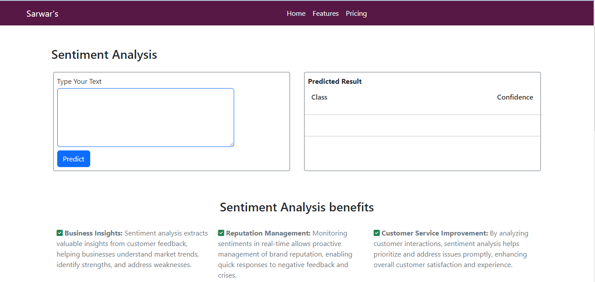

# Sentiment Analysis Machine Learning Model Using Python & Django.

This is the web version part, where user can analysis their text or any written sentiment via the app. I've been using Logistic Regression Model since it's a fast and higher accuracy.
And transferred it to web version with RESTapi. You can use this with your website. For rest API contact me via <b>Email or LinkedIn.</b>

If you want to run the app, you have to install python in your localhost. After that, follow the commands below..

<b>Screenshot:</b> 

<b>LinkedIn:</b> [LinkedIn](linkedin.com/in/monsieursarwar/)
<b>My website:</b> [sarwars.me](https://resume-plum-ten.vercel.app/)

